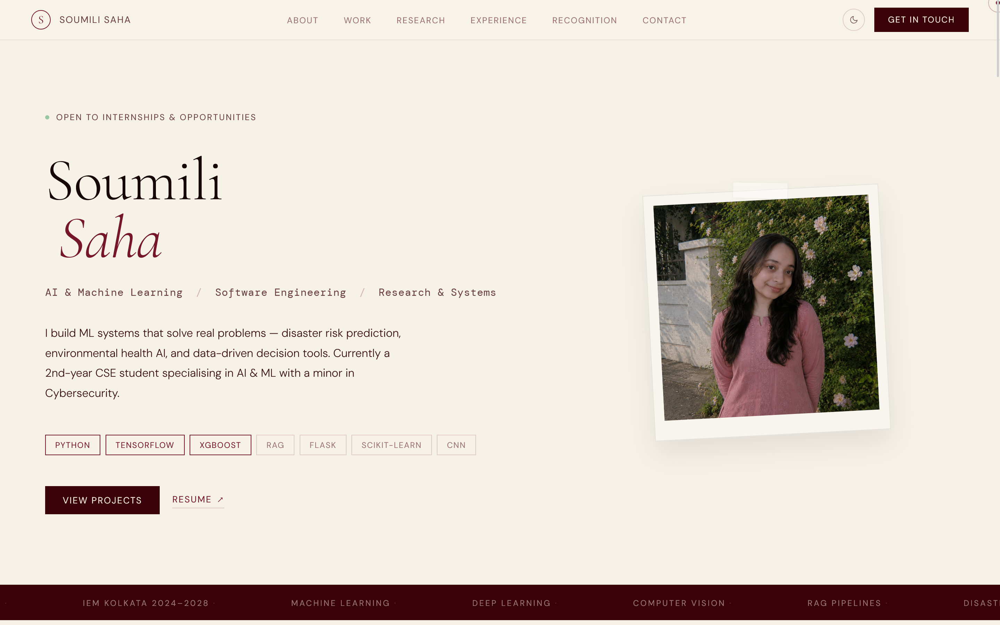

<h1 align="center">Soumili Saha - Personal Portfolio</h1>

<p align="center">
  A modern, responsive portfolio website built using core web technologies.
</p>

<p align="center">
  <a href="[PORTFOLIO_URL]" target="_blank" rel="noopener noreferrer">
    
  </a>
</p>

## Preview



## Overview

This repository contains the source code for the personal portfolio of Soumili Saha. The website serves as a centralized platform to showcase academic coursework, engineering projects, research activities, and professional experience. Built with native web technologies, the project prioritizes fast load times and clean, accessible content presentation.

## Features

- Responsive design
- Light/Dark theme support
- Project showcase
- Research section
- Experience timeline
- Achievements and certifications
- Contact section
- Automatic deployment via Vercel

## Design Philosophy

The portfolio emphasizes clarity, readability, and content-first presentation. The visual design follows a minimal editorial aesthetic with a custom light and dark theme, allowing projects, research, and achievements to remain the primary focus.

## Technology Stack

The project is built using native web technologies to ensure lightweight performance and standard compliance.

* **HTML5**: Semantic markup for structural integrity.
* **CSS3**: Layout design using Flexbox and Grid, with CSS custom properties for styling light and dark themes.
* **JavaScript**: ES6 scripting for interactive navigation, theme management, and dynamic elements.
* **Vercel**: Cloud hosting and automated continuous deployment.

## Project Structure

The codebase is organized in a clear, flat structure to separate styling, layout, script actions, and static assets:

```text
portfolio/
├── assets/            # Static assets including project screenshots and profile image
├── documents/         # Academic and professional documents (e.g., resume.pdf)
├── index.html         # Main entry point containing structural HTML content
├── style.css          # Core stylesheet containing custom styling, themes, and layout rules
├── main.js            # Core JavaScript controlling UI interactions and theme states
└── README.md          # Project documentation
```

## Run Locally

Clone the repository:

```bash
git clone https://github.com/YOUR_USERNAME/portfolio.git
```

Navigate into the project directory:

```bash
cd portfolio
```

Open `index.html` directly in your browser or use a local development server such as VS Code Live Server.

## Deployment

The website is configured for continuous integration and deployment (CI/CD) via Vercel.

To deploy this project to Vercel:
1. Connect the GitHub repository to your Vercel account.
2. Select the repository and import the project.
3. Keep default build settings (no build command is required, as the project consists of static assets).
4. Deploy. Subsequent updates pushed to the main branch will trigger automatic production builds and deployments.

## Contact

Feel free to reach out for research collaborations, professional inquiries, or project discussions.

- **Name**: Soumili Saha
- **Education**: B.Tech in Computer Science and Engineering (AI & ML), Institute of Engineering & Management (IEM), Kolkata
- **Focus Areas**: Machine Learning, Applied AI, Software Engineering, Research
- **GitHub**: [github.com/logitechsoumili](https://github.com/logitechsoumili)
- **LinkedIn**: [linkedin.com/in/logitechsoumili](https://www.linkedin.com/in/logitechsoumili)
- **Email**: logitechsoumili@gmail.com

## License

This project is intended for personal portfolio use. Please do not reproduce the content, branding, or personal information without permission.